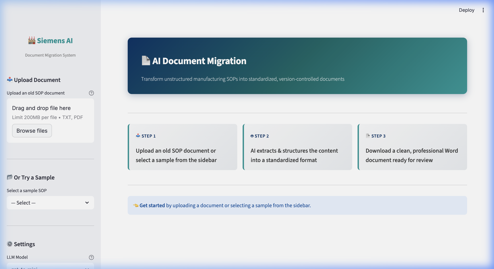

# 🏭 AI for Document Migration — Siemens POC

A Python-based tool using Large Language Models to migrate unstructured manufacturing SOPs into standardized, version-controlled documents.

---

## 📸 Visual Demo

### Landing Page
The intuitive interface allows users to upload documents or select from existing samples.



### Extractions & Metrics
AI-powered extraction with confidence scoring, safety warning detection, and automated Word document generation.


---

## 🎯 Overview

Manufacturing facilities maintain hundreds of Standard Operating Procedures (SOPs) that are often:
- Written informally with inconsistent formatting
- Missing clear sections for safety, equipment, and procedures
- Difficult to audit, version-control, or standardize

This tool uses **AI-powered document understanding** to:
1. **Read** messy, unstructured SOP documents (TXT/PDF)
2. **Extract** structured data (safety warnings, equipment, steps) using an LLM
3. **Generate** clean, professional Word documents in a standardized Siemens format

---

## 🛠 Tech Stack

| Technology | Purpose |
|------------|---------|
| **Python 3.10+** | Core language |
| **LangChain** | LLM orchestration & structured output |
| **OpenAI GPT-4o-mini** | Document understanding & extraction |
| **Pydantic** | Schema enforcement & validation |
| **python-docx** | Word document generation |
| **PyPDF** | PDF text extraction |
| **Streamlit** | Interactive web UI |

---

## 📁 Project Structure

```
siemens_doc_migration_poc/
├── input_docs/                  # Old, messy SOP documents
│   ├── pcb_soldering_sop.txt
│   ├── motor_assembly_sop.txt
│   └── quality_inspection_sop.txt
├── output_docs/                 # Generated standardized documents
├── templates/                   # Reserved for future templates
├── schema.py                    # Pydantic data model (SiemensSOP)
├── migrator.py                  # Extraction engine + Word generator
├── app.py                       # Streamlit web application
├── requirements.txt             # Python dependencies
├── .env.example                 # API key template
└── README.md                    # This file
```

---

## 🚀 Quick Start

### 1. Clone & Install

```bash
cd "Document Migration"
pip install -r requirements.txt
```

### 2. Configure API Key

```bash
cp .env.example .env
# Edit .env and add your OpenAI API key
```

### 3. Run the App

```bash
streamlit run app.py
```

### 4. Use the App

1. Upload an old SOP document (or select a sample)
2. Click **"Extract & Migrate"** to analyze with AI
3. Review the extracted structured data and confidence score
4. Click **"Generate New SOP Document"** to create a Word file
5. Download the standardized `.docx` output

---

## 🔧 CLI Usage

You can also run the migration engine directly:

```bash
python migrator.py input_docs/pcb_soldering_sop.txt
```

---

## 📊 How It Works

```
┌─────────────────┐     ┌──────────────────┐     ┌─────────────────────┐
│  Old Document    │────▶│  LLM Extraction  │────▶│  Standardized SOP   │
│  (messy .txt/.pdf)│     │  (GPT-4o-mini)   │     │  (clean .docx)      │
└─────────────────┘     └──────────────────┘     └─────────────────────┘
         │                       │                         │
    Raw text with          Pydantic schema           Professional Word
    mixed formatting       enforces structure        doc with branding,
    & scattered info       (safety, steps, etc.)     sections & formatting
```

**Key Features:**
- 🔍 **Structured Output**: LLM is forced to return Pydantic-compliant JSON
- ⚠️ **Safety Extraction**: All warnings, cautions, and PPE requirements are captured
- 📊 **Confidence Scoring**: AI self-assesses extraction quality (1-10)
- 📄 **Professional Output**: Siemens-branded Word documents with consistent formatting

---

## 📝 Schema (SiemensSOP)

| Field | Type | Description |
|-------|------|-------------|
| `title` | `str` | Standardized procedure title |
| `document_id` | `str` | Unique ID (e.g., SOP-2024-001) |
| `version` | `str` | Version number (default: 2.0) |
| `department` | `str` | Responsible department |
| `safety_warnings` | `List[str]` | All extracted safety precautions |
| `equipment` | `List[str]` | Required tools and instruments |
| `steps` | `List[str]` | Clean, numbered procedure steps |
| `confidence_score` | `int` (1-10) | AI extraction confidence |

---

## 📜 License

This is a Proof of Concept (POC) for educational purposes. Not for production use.
